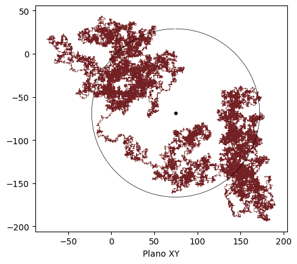
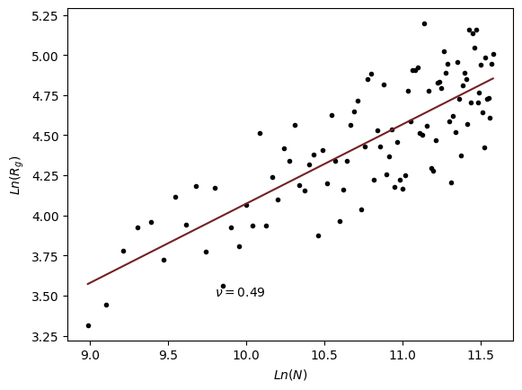
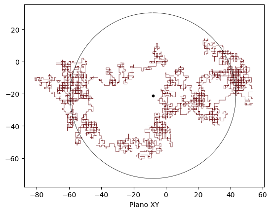
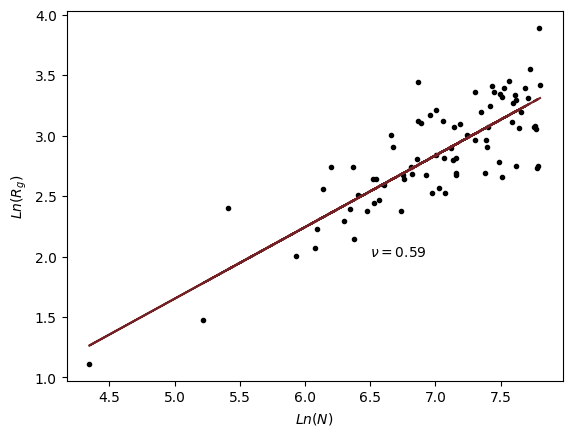

# Cadena Fantasma y Autoevitante

[](https://colab.research.google.com/github/JuanFLandaverde/Cadena-fantasma-y-autoevitante/blob/main/Cadena_Fantasma_y_autoevitante.ipynb)

Proyecto de simulacion para comparar una cadena fantasma y una cadena autoevitante mediante caminatas aleatorias. El notebook permite visualizar trayectorias, calcular el radio de giro y observar el comportamiento de escalamiento.

## Vista previa

Estas imagenes fueron extraidas de una ejecucion previa del notebook, para que el resultado pueda verse sin ejecutar las celdas.

| Cadena fantasma | Escalamiento fantasma |
| --- | --- |
|  |  |

| Cadena autoevitante | Escalamiento autoevitante |
| --- | --- |
|  |  |

## Archivos

- `Cadena_Fantasma_y_autoevitante.ipynb`: notebook principal.
- `figuras/`: imagenes de vista previa generadas desde el notebook.
- `requirements.txt`: dependencias basicas para ejecutar el notebook localmente.

## Requisitos

```bash
pip install -r requirements.txt
```

En Google Colab, `numpy` y `matplotlib` suelen estar disponibles por defecto.

## Nota de ejecucion

Algunas celdas usan simulaciones grandes, por ejemplo `Fantasma(100000, mostrar=1)` o `Escalamiento(100)`. Si solo quieres probar el notebook rapidamente, empieza con valores mas pequenos de `N` y `K`.
